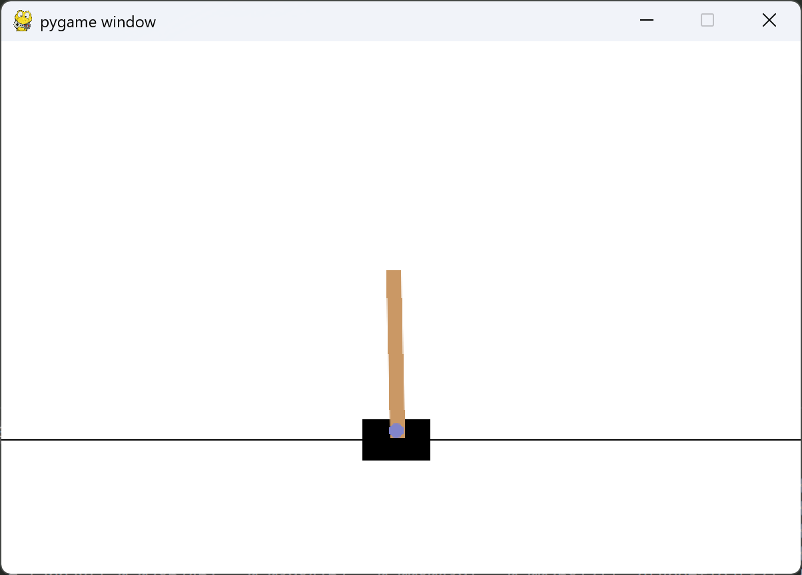

# 强化学习入门——倒立摆（CartPole）

## 环境配置

官网下载最新版本的gymnasium（原gym已经迁移到了gymnasium）

```sh
pip install gymnasium
pip install swig
pip install "gymnasium[box2d]"
```

运行测试代码：

```python
import gymnasium as gym
import time

# 生成环境
env = gym.make("CartPole-v1", render_mode="human")
# 环境初始化
state = env.reset()

episode_over = False
while not episode_over:
    # 渲染画面
    env.render()
    # 从动作空间随机获取一个动作
    action = env.action_space.sample()
    # agent与环境进行一步交互
    observation, reward, terminated, truncated, info = env.step(action)
    
    print("state = {0}; reward = {1}".format(state, reward))
    time.sleep(0.5)
    episode_over = terminated or truncated
# 环境结束
env.close()

```



中间使用sleep暂停防止一闪而过看不清，`render_mode="human"`可以指定渲染模式，这里设置成可视化方便观察

action = env.action_space.sample()随机从动作空间选择一个，之后env.step()与环境交互，并获得新环境，以及奖励