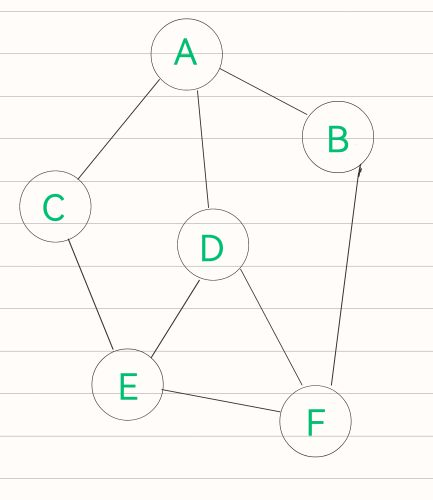

# 图的遍历

图的遍历主要有深度优先遍历(DFS)和广度优先遍历(BFS)


## 广度优先遍历

从某一节点触发,由近及远扩散开

广度优先遍历即优先遍历与当前点邻接的点,遍历全部邻接点后,再对遍历过的重复这个过程,直到全部遍历完成.

广度优先遍历类似树的层序遍历,可以采用队列来辅助

我们对下面这个图进行广度优先遍历:


### 邻接表

```c++
void BFS()
{
    queue<int> que;
    if (nodes.empty())
    {
        return;
    }
    vector<int> v_traversal(nodes.size(), 0);
    que.push(0);
    while (!que.empty())
    {
        int index = que.front();
        que.pop();
        if (v_traversal[index] == 1)
        {
            continue;
        }
        v_traversal[index] = 1;
        cout << nodes[index].data << " ";
        for_each(nodes[index].link.begin(), nodes[index].link.end(),
                 [&](linknode now)
                 {
                     que.push(now.index);
                 });
    }
    cout << endl;
}

```

运行结果:

    A B C D F E

### 邻接矩阵

```c++
void BFS()
{
    queue<int> que;
    int n = nodes.size();
    vector<int> v_travelsaled(n, 0);

    que.push(0);
    while (!que.empty())
    {
        int index = que.front();
        que.pop();
        if (v_travelsaled[index] == 1)
        {
            continue;
        }
        v_travelsaled[index] = 1;
        cout << nodes[index].data << " ";
        for (int i = 0; i < n; i++) // 对于无向图,这里可以优化
        {
            if (adjMat[index][i] != 0 && v_travelsaled[i] == 0)
            {
                que.push(i);
            }
        }
    }
    cout << endl;
}
```


运行结果

    A B C D F E

## 深度优先遍历

深度优先遍历(`DFS`)是优先走到底,一直到尽头再返回的遍历方式

+ 先选择一个点为起点
+ 遍历后再遍历邻接的点,再对这个点执行这个过程
+ 到尽头后返回上个遍历的点

我们对上面那张图进行DFS

### 邻接表

```c++
void DFS()
{
    vector<int> v_travelsal(nodes.size(), 0);
    DFS_in(v_travelsal, 0);
    cout << endl;
}

void DFS_in(vector<int> &v_travelsal, int index)
{
    if (v_travelsal[index] == 1)
    {
        return;
    }
    v_travelsal[index] = 1;
    cout << nodes[index].data << " ";
    for_each(nodes[index].link.begin(), nodes[index].link.end(), [&](linknode &now)
             { DFS_in(v_travelsal, now.index); });
}
```

运行结果:

    A B F E C D


### 无递归版本

用栈来辅助

```c++
void DFS_noRecursion()
{
    stack<int> sta;
    sta.push(0);
    vector<int> v_travelsal(nodes.size(), 0);

    while (!sta.empty())
    {
        int index = sta.top();
        sta.pop();
        if (v_travelsal[index] == 1)
        {
            continue;
            ;
        }
        v_travelsal[index] = 1;
        cout << nodes[index].data << " ";

        for_each(nodes[index].link.begin(), nodes[index].link.end(), [&](linknode &now)
                 { sta.push(now.index); });
    }
    cout << endl;
}
```

运行结果:

    A D F E C B


### 邻接矩阵

```c++
void DFS()
{
    stack<int> sta;
    int n = nodes.size();
    vector<int> v_traversaled(n, 0);
    sta.push(0);
    while (!sta.empty())
    {
        int index = sta.top();
        sta.pop();
        if (v_traversaled[index] == 1)
        {
            continue;
        }
        v_traversaled[index] = 1;
        cout << nodes[index].data << " ";
        for (int i = 0; i < n; i++)
        {
            if (adjMat[index][i] != 0 && v_traversaled[i] == 0)
            {
                sta.push(i);
            }
        }
    }
    cout << endl;
}
```
运行结果:

    A D F E C B


## 复杂度分析

### 时间复杂度

V是顶点(Vertex),E是边(Edge)
遍历过程中,所有顶点都会访问一次,使用`O(|V|)`,无向图所有的边会被访问2次,使用`O(2|E|)`时间,总体`O(|V|+|E|)`

### 空间复杂度

辅助数组元素数为`|V|`,遍历过程中队列/栈的最大元素数为`|V|`,空间复杂度为`O(|V|)`