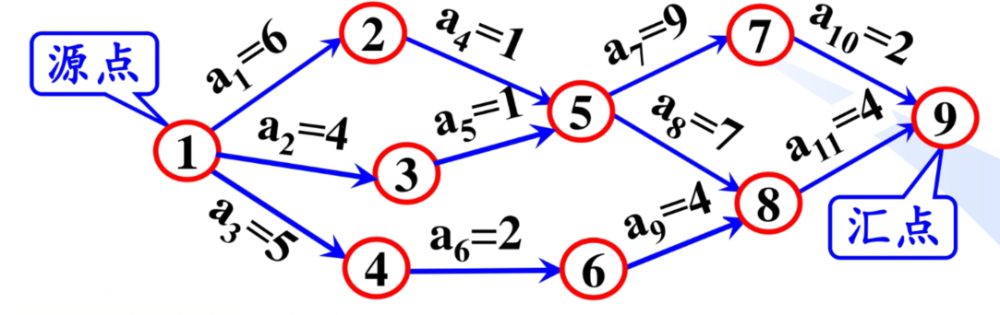

# 拓扑排序&关键路径

## 拓扑排序

### 用途

+ 有时一个任务可以拆分成若干个子任务
+ 子任务间存在一些先后关系,必须完成前置任务,才能进行当前任务

例如游戏中的技能树


    只狼中的苇名流派招式,必须从一字斩学起,学会前置招式(一字斩,下鲤,登鲤,躯干吐息,流水,一字斩-二连)才能学习 绝技·苇名十字斩

### AOV网

在有向图中,顶点表示活动,有向边表示先后关系,这样的有向图即为`AOV网`(Activity On Vertex Network)

+ 如果AOV网中存在边E(i,j),则表示,做j之前必须完成i
+ AOV网中不能有回路,一个任务不能以自己为先决条件.AOV是一个`有向无环图`

对于上面的韦名流招式,可以抽象成一个AOV网,我们用字母表示招式


### 拓扑排序

**拓扑序列** : AOV网中的顶点排成的线性序列,并且在这个序列中,如果i排在j前面,那么一定不存在边j->i;反之,如果存在i->j,则拓扑序列中i一定在j前面

拓扑排序即为求得拓扑序列的过程,帮助决定完成任务的次序

如果得不到拓扑序列,则该AOV网不合法,存在环,无法完成任务

### 算法实现

#### 拓扑序
拓扑排序算法过程如下:

1. 从图中选择一个入度为0的点,加入拓扑序列
2. 删除这条边及其引出的所有边
3. 重复以上过程,直到完成拓扑序列或者不存在入度为0的点(有向图不合法)

    拓扑序列未必唯一

代码实现:

```c++
    void topoOrder() // 拓扑排序
    {
        int n = nodes.size();
        vector<int> inDegree(n, 0); // 记录各点入度
        stack<int> sta;             // 辅助栈
        for_each(nodes.begin(), nodes.end(), [&](node &now)
                 {
            for(linknode& i : now.link)
            {
                inDegree[i.index]++;
            } }); // 统计各点入度

        for (int i = 0; i < n; i++)
        {
            if (inDegree[i] == 0)
            {
                sta.push(i); // 入度为0的点入栈
            }
        }

        while (!sta.empty())
        {
            int index = sta.top();
            sta.pop();
            cout << nodes[index].data << " ";
            for (linknode &i : nodes[index].link)
            {
                inDegree[i.index]--; // 减少入度,模拟删除边的操作
                if (inDegree[i.index] == 0)
                {
                    sta.push(i.index); // 入度为0的点入栈
                }
            }
        }
        cout << endl;
    }
```

对上面的AOV网进行测试:

    A C B F E H D

输出的是合法的拓扑排序

#### 逆拓扑序

特殊地,深度优先遍历可以生成逆拓扑序
对于i->j,深度优先遍历可以保证先遍历到j再遍历i,类似二叉树后序遍历

```c++
    void dfs_in(vector<int> &traversaled, int index)
    {
        traversaled[index] = 1; // 标记为已访问
        for (linknode &i : nodes[index].link)
        {
            if (traversaled[i.index] == 0)
            {
                dfs_in(traversaled, i.index);
            }
        }
        cout << nodes[index].data << " ";
    }
    void re_topoOrder()
    {
        int n = nodes.size();
        vector<int> traversaled(n, 0);
        dfs_in(traversaled, 0);
        cout << endl;
    }
```

运行结果:

    D H E F B C A


## 关键路径

### AOE网




`AOE网(Activity On Edges)`:**有向边**表示活动或者任务,`边上的权值`表示`活动时间`;**顶点**表示事件,代表入边的活动已经完成,而出边的活动可以开始


**源点**表示开始(入度为0)

**汇点**表示结束(出度为0)

从源点到汇点的路径会不止一条, 路径长度有所不同

只有各条路径的活动都完成了,才算任务完成,完成任务的时间取决于源点到汇点的最长路径长度,这条路径即为`关键路径(Cirtical Path)`

关键路径上的活动成为`关键活动`

### 与关键活动有关的量:

1. 事件v[j]的最早发生时间ve[j]
2. 事件v[j]的最迟发生时间vl[j]
3. 活动a[i]的最早开始事件e[i]
4. 活动a[i]的最早开始事件l[i]

#### 事件v[j]的最早发生时间ve[j]

+ 对于源点,`ve[source] = 0`
+ 对于其它点i,如果有多条边(m1 -> i,m2 -> i ...)汇入,那么

    ve[j] = max(weight(m1,i) + ve[m1],weight(m2,i) + ve[m2],...)

由这个式子可以递推出各事件最早发生时间

#### 事件v[j]的最迟发生时间vl[j]

在不推迟工期(汇点的最早发生时间不推迟)的前提下,事件v[j]允许的最迟的开始时间,等于ve[n] - v[j]到v[n]的最长路径长度,v[n]为汇点


+ vl[n] = ve[n]
+ vl[j] = min{vl[k] - weight(j,k)},j != n, k是j后继事件

#### 活动a[i]的最早开始事件e[i]

a[i] = `<j,k>`,则`e[i] = ve[j]`

#### 活动a[i]的最早开始事件l[i]

不引起时间延误的前提下,活动a[i]允许的最迟开始时间,如果a[i] = `<j,k>`,则:

    l[i] = vl[k] - weight(j,k)


### 关键活动

关键路径上的关键活动,满足活动的最早开始时间等于最迟开始时间,即:

    e[i] = l[i]


求关键活动思路如下

1. 对AOE网进行拓扑排序
2. 由拓扑序求出各顶点v[j]的ve[j]
3. 由逆拓扑序求出各顶点v[j]的vl[j]
4. 根据ve[j]和vl[j]算出各活动a[i]的e[i]和l[i],如果有`e[i] == l[i]`,那么这个活动是关键活动

### 算法实现

```c++
struct AOE : public graph
{
    list<int> topolist;
    vector<int> ve;
    vector<int> vl;
    int n;
    AOE(int nodes_count, const vector<node> &nodes)
        : graph(nodes_count, nodes, true), ve(nodes_count, 0), vl(nodes_count), n(nodes_count) {}
    AOE(int nodes_count)
        : graph(nodes_count, true), ve(nodes_count, 0), vl(nodes_count), n(nodes_count) {}
    void addEdge(int i, int j, int weight) // 权图
    {
        nodes[i].link.push_back(linknode(j, weight));
        if (!direct)
        {
            nodes[j].link.push_back(linknode(i, weight));
        }
    }
    virtual void topoOrder() // 拓扑排序
    {
        topolist.clear();
        int n = nodes.size();
        vector<int> inDegree(n, 0); // 记录各点入度
        stack<int> sta;             // 辅助栈
        for_each(nodes.begin(), nodes.end(), [&](node &now)
                 {
            for(linknode& i : now.link)
            {
                inDegree[i.index]++;
            } }); // 统计各点入度

        for (int i = 0; i < n; i++)
        {
            if (inDegree[i] == 0)
            {
                sta.push(i); // 入度为0的点入栈
            }
        }

        while (!sta.empty())
        {
            int index = sta.top();
            sta.pop();
            topolist.push_back(index);

            for (linknode &i : nodes[index].link)
            {
                inDegree[i.index]--; // 减少入度,模拟删除边的操作
                if (inDegree[i.index] == 0)
                {
                    sta.push(i.index); // 入度为0的点入栈
                }
            }
        }
        cout << endl;
    }

    void vertexEarliestTime() // 求ve
    {
        for (int &i : topolist)
        {
            for (linknode &j : nodes[i].link)
            {
                if (ve[j.index] < ve[i] + j.weight)
                {
                    ve[j.index] = ve[i] + j.weight;
                }
            }
        }
    }

    void vertexLastTime() // 求vl
    {
        for (int i = 0; i < n; i++)
        {
            vl[i] = ve[n - 1];
        }
        for_each(topolist.rbegin(), topolist.rend(), [&](int i)
                 {
                     for (linknode &j : nodes[i].link)
                     {
                         if (vl[i] > vl[j.index] - j.weight)
                         {
                             vl[i] = vl[j.index] - j.weight;
                         }
                     } });
    }
    void CriticalPath()
    {
        topoOrder();
        vertexEarliestTime();
        vertexLastTime();

        for (int i : ve)
        {
            cout << i << " ";
        }
        cout << "\n";

        for (int i : vl)
        {
            cout << i << " ";
        }
        cout << "\n";

        list<pair<int, int>> criticalPath;
        for (int i : topolist)
        {
            for (linknode j : nodes[i].link)
            {
                if (ve[i] == vl[j.index] - j.weight)
                {
                    criticalPath.push_back(make_pair(i, j.index));
                }
            }
        }
        for_each(criticalPath.begin(), criticalPath.end(), [](pair<int, int> &a)
                 { cout << a.first << "->" << a.second << " "; });
    }
};

int main()
{
    AOE critical(9);
    critical.addEdge(0, 1, 6);
    critical.addEdge(0, 2, 4);
    critical.addEdge(0, 3, 5);

    critical.addEdge(1, 4, 1);
    critical.addEdge(2, 4, 1);
    critical.addEdge(3, 5, 2);

    critical.addEdge(4, 6, 9);
    critical.addEdge(4, 7, 7);
    critical.addEdge(5, 7, 4);

    critical.addEdge(6, 8, 2);
    critical.addEdge(7, 8, 4);

    critical.CriticalPath();

    return 0;
}
```

结果如下:

    0 6 4 5 7 7 16 14 18
    0 6 6 8 7 10 16 14 18
    0->1 1->4 4->6 4->7 7->8 6->8
