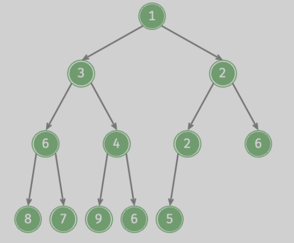

# 堆

## 基础概念

堆是一种`完全二叉树`的特例,并且有:

+ 大根堆(`max heap`),任意节点的值 >= 子节点
+ 小根堆(`min heap`),任意节点的值 <= 子节点



堆具有完全二叉树的性质:最底层从左向右填充

堆的根称为`堆顶`,堆的最底层靠右称为`堆底`

大顶堆的堆顶最大,小顶堆的堆顶最小

## 堆的实现

由于堆是一个完全二叉树,所以可以很方便地用顺序结构储存

对于一个索引`i`

+ 其左子树为 [`2 * i + 1`]
+ 其右子树为 [`2 * i + 2`]
+ 父节点为 [`(i - 1)/2`] (向下取整)

```c++
struct node
{
    int data;
    node(int data)
        : data(data) {}
};

struct heap
{
    vector<node *> nodes;

    heap(const vector<node *> &nodes)
        : nodes(nodes) {}
    heap() {}
    inline int father(int index)
    {
        return (index - 1) / 2; // 父亲节点
    }
    inline int leftChild(int index)
    {
        return index * 2 + 1; // 左子树
    }
    inline int rightChild(int index)
    {
        return index * 2 + 2; // 右子树
    }
    inline int size()
    {
        return nodes.size();
    }
    inline int top()
    {
        return nodes[0]->data; // 堆顶
    }
};

```

## 基本操作

### 插入节点/入队

对于插入节点,执行如下步骤:

1. 将新元素插入堆底
2. 这时堆的结构被破坏,进行调整,执行起泡操作,如果不符合条件,则与父节点调换,直到满足条件

```c++
void heap::push(int data)
{
    int index = size();
    nodes.push_back(new node(data)); // 插入堆底

    // 进行堆化
    while (index > 0)
    {
        // 小根堆
        int fi = father(index);
        if (nodes[fi]->data > nodes[index]->data)
        {
            node *temp = nodes[fi];
            nodes[fi] = nodes[index];
            nodes[index] = temp;
            index = father(fi);
        }
        else
        {
            break;
        }
    } // 进行气泡操作
}

```

测试一下:

```c++
int main()
{
    heap myfirst_heap;
    myfirst_heap.push(1);
    myfirst_heap.push(5);
    myfirst_heap.push(4);
    myfirst_heap.push(8);
    myfirst_heap.push(3);
    myfirst_heap.push(7);
    myfirst_heap.push(2);
    myfirst_heap.print();
    return 0;
}

```

结果如下:

    1 3 2 8 5 7 4

### 删除节点/出队

堆是从堆顶开始出队,如果直接删除根节点,会很难重建堆,为了方便,采用下面的方法出堆:

1. 交换堆底和堆顶
2. 对新堆顶向下执行起泡操作,恢复堆结构

```c++
void heap::pop()
{
    swap(nodes[0], nodes[nodes.size() - 1]);
    nodes.pop_back();
    int index = 0;
    int n = size();
    while (index < n)
    {
        int lc = leftChild(index);
        int rc = rightChild(index);
        int toswap = index;
        if (lc < n && nodes[lc]->data < nodes[toswap]->data)
        {
            toswap = lc;
        }
        if (rc < n && nodes[rc]->data < nodes[toswap]->data)
        {
            toswap = rc;
        }

        if (toswap != index)
        {
            swap(nodes[toswap], nodes[index]);
            index = toswap;
        }
        else
        {
            break;
        }
    }
}

```

对刚才创建的堆执行如下操作:

```c++
    myfirst_heap.pop();
    myfirst_heap.print();
    myfirst_heap.pop();
    myfirst_heap.print();
    myfirst_heap.pop();
    myfirst_heap.print();
    myfirst_heap.pop();
    myfirst_heap.print();
```

结果如下:

    1 3 2 8 5 7 4
    2 3 4 8 5 7
    3 5 4 8 7
    4 5 7 8
    5 8 7