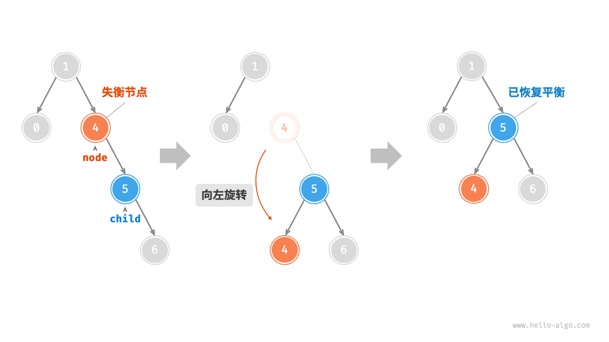
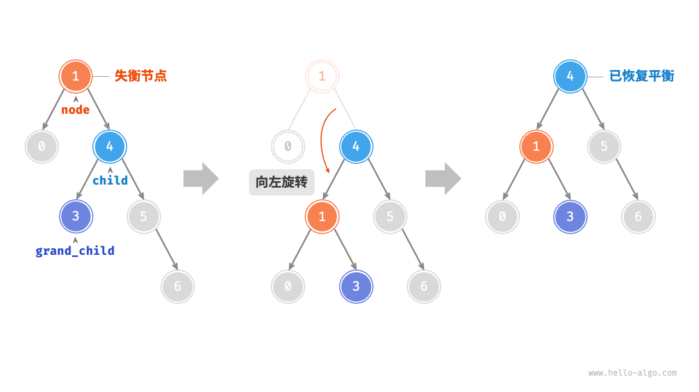
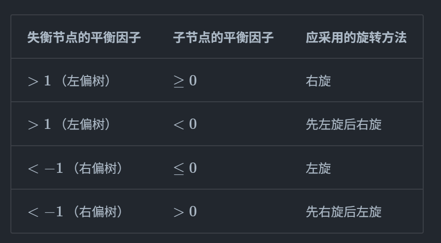

# 高度平衡树

二叉查找树的查找时间是由树高决定的,而BST有可能退化成一个链表,查找效率会很低

我们希望每个节点的左右子树高度尽可能相等,即**平衡**

## 概念

**理想平衡**:满二叉树或者完全二叉树,树高h = int(logn)

**渐进平衡**:适当放宽标准,O(h) = O(logn)

**高度平衡树**:也叫`AVL树`,`平衡二叉树`,是一种二叉查找树,它的任意节点的左右子树的高度最多相差1

**平衡系数**:节点P的平衡系数为`P的左子树高度 - P的右子树高度`

由此可知,AVL的平衡系数只能是1,0,-1
另外,空二叉树是AVL树

## 实现

### 核心操作

与BST一样,核心操作是查找,插入,删除,而插入和删除操作可能破坏AVL的平衡,此外AVL需要通过旋转保持平衡

### 旋转

旋转操作总共四种

+ 单旋转:`左旋`,`右旋`
+ 双旋转:`先左旋后右旋`,`先右旋后左旋`

#### 单旋转

以左旋转为例


失衡节点为node,右孩子为child
左旋操作将child提起来成为新的父节点,具体的做法就是:

1. child取代node的位置
2. 如果child有左孩子,那node的右孩子指针指向这个左孩子
3. child左孩子指针指向node

右旋只是镜像版本,将左旋的代码中左右互换即可

```c++
void AVL::LL(node *&nownode)
{
    node *temp = nownode;
    node *child = nownode->rightChild;
    nownode = child; // 取代
    temp->rightChild = child->leftChild;
    child->leftChild = temp;

    // 更新高度
    updateHeight(temp);
    updateHeight(child);
}

void AVL::RR(node *&nownode)
{
    node *temp = nownode;
    node *child = nownode->leftChild;
    nownode = child; // 取代
    temp->leftChild = child->rightChild;
    child->rightChild = temp;

    // 更新高度
    updateHeight(temp);
    updateHeight(child);
}
```

#### 双旋转

以LR为例:

调用单旋转,先左旋child(node的左孩子,因为要对node右旋转),再右旋node

RL同理

```c++
void AVL::LR(node *&nownode)
{
    LL(nownode->leftChild);
    RR(nownode);
}

void AVL::RL(node *&nownode)
{
    RR(nownode->rightChild);
    LL(nownode);
}
```

#### 旋转选择

现在有了四种旋转操作,我们需要通过这些操作维持平衡

对于以失衡节点为根节点的二叉树,如果是左偏树(左高 > 右高),那么需要对其采用右旋转,而左孩子的右高 > 左高,则需要先对左孩子进行调整

有 `平衡系数 = 左高 - 右高`,可以据此判断



代码如下:

```c++
void AVL::rotate(node *&nownode)
{
    int nownodeBF = balanceFactor(nownode);
    node *child;
    int childBF;
    if (nownodeBF > 1) // 左偏树
    {
        child = nownode->leftChild;
        childBF = balanceFactor(child);
        if (childBF < 0) // 右边高
        {
            LR(nownode);
        }
        else
        {
            RR(nownode);
        }
    }
    else if (nownodeBF < 1) // 右偏树
    {
        child = nownode->rightChild;
        childBF = balanceFactor(child);
        if (childBF > 0) // 左边高
        {
            RL(nownode);
        }
        else
        {
            LL(nownode);
        }
    }
}
```

### 插入

与BST类似,但是需要更新高度和旋转平衡


```c++
void AVL::insert(int key)
{
    insert_in(root, key);
}

void AVL::insert_in(node *&nownode, int key)
{
    if (nownode == nullptr)
    {
        nownode = new node(key);
    }
    else if (nownode->key < key)
    {
        insert_in(nownode->rightChild, key);
    }
    else if (nownode->key > key)
    {
        insert_in(nownode->leftChild, key);
    }

    rotate(nownode);       // 从底向上调用旋转函数来平衡
    updateHeight(nownode); // 更新节点高度
}
```

### 删除

与BST类似,但是同样需要高度更新和旋转平衡,并且由于从底下删除会影响很大,需要从底向下平衡


