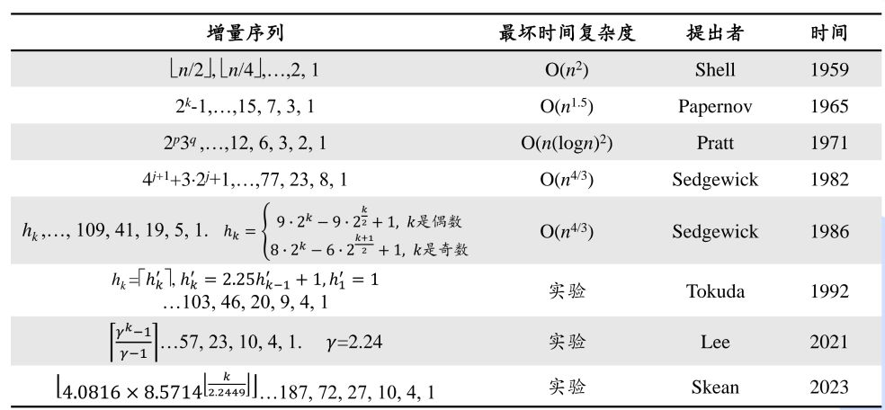

# 插入排序

## 直接插入排序

排好一个有序序列,对于接下来的元素,在序列中合适的位置插入,保持序列中的有序性

```c++
void insertSort(vector<int> &datas)
{
    int n = datas.size();
    for (int i = 1; i < n; i++)
    {
        int temp = datas[i]; // 插入过程中会覆盖掉datas值,提前保存
        int j = i - 1;
        while (datas[j] > temp && j >= 0) // 寻找合适位置
        {
            datas[j + 1] = datas[j]; // 后移元素,模拟插入过程
            j--;
        }
        datas[j + 1] = temp;
    }
}

void insertSort2(vector<int> &datas)//另一种写法
{
    int n = datas.size();
    for (int i = 0; i < n; i++)
    {
        for (int j = 0; j < i; j++)
        {
            if (datas[i] < datas[j])
            {
                int temp = datas[i];
                datas[i] = datas[j];
                datas[j] = temp;
            }
        }
    }
}
```

由于数组不能直接插入,元素需要移动,复杂度为`O(N^2)`

插入排序算法是稳定的,适用于数据较少的情况

## 折半插入排序

对直接插入排序进行改进,运用二分查找优化寻找插入位置的时间

这里要用到`upper_bound()`和`memmove`(STL容器改为`std::copy`)

```c++
template <class ForwardIterator, class T>
ForwardIterator upper_bound (ForwardIterator first, ForwardIterator last, const T& val);
//用于在已排序的容器（如vector、数组或有序集合）中查找某个值的上界（即大于该值的最小元素）

void* memmove(void* dest, const void* src, size_t count);
//memmove函数会将源内存中的数据复制到目标内存中
//并确保即使目标内存和源内存有重叠，数据也能正确复制
//这是与另一个类似的函数memcpy的主要区别，后者在存在重叠时的行为是未定义的。

template <typename InputIt, typename OutputIt>
OutputIt copy(InputIt first, InputIt last, OutputIt d_first);
//std::copy函数会将从first到last范围内的元素复制到从d_first开始的目标范围内
```

折半插入排序实现如下:

```c++
void binary_insertSort(vector<int> &datas)
{
    int n = datas.size();
    for (int i = 1; i < n; i++)
    {
        int temp = datas[i];
        int index = upper_bound(datas.begin(), datas.begin() + i, temp) - datas.begin();
        copy(datas.begin() + index, datas.begin() + i, datas.begin() + index + 1);
        datas[index] = temp;
    }
}
```

折半插入排序虽然在查找上做了优化,但复杂度仍为`O(N^2)`

## 希尔排序

插入排序越接近有序,效率就越高,希尔排序就是先设法接近有序

希尔排序首先对数据进行分组,每组内部进行插入排序

分组使间隔的数据为同一组,这样跨度更大,效率更高

例如: 对于待排序的数组:`{9, 1, 2, 5, 7, 4, 8, 6, 3, 5}`

+ 首先令间隔`gap`为5,即分为5组,间隔为5的在同一组,分成这几组: `{9, 4}, {1, 8}, {2, 6}, {5, 3}, {7, 5}`
+ 然后组内进行排序: `{4, 9}, {1, 8}, {2, 6}, {3, 5}, {5, 7}`,这时数组为`{4, 9, 1, 8, 2, 6, 3, 5, 5, 7}`
+ 然后再令`gap = gap / 2`,重复上述操作
+ `gap = 1`时排序完成

```c++
void shellSort(vector<int> &datas)
{
    int n = datas.size();
    for (int gap = n / 2; gap > 0; gap /= 2)
    {
        // 对每一组元素进行插入排序
        for (int i = gap; i < n; i++)
        {
            int j = i - gap;
            int temp = datas[i];
            while (j >= 0 && datas[j] > temp)
            {
                datas[j + gap] = datas[j];
                j -= gap;
            }
            datas[j + gap] = temp;
        }
    }
}

```

gap = n/2,n/4 ... 只是一种增量选取方式,还可以用的别方法选

希尔排序不稳定,希尔排序的复杂度与增量选取方式有关

