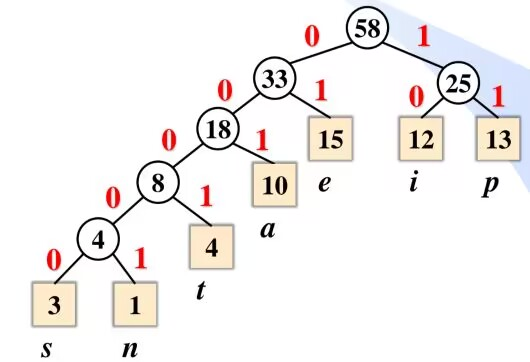

# 压缩与哈夫曼树

## 前置概念

### 扩充二叉树

在二叉树的空指针位置增加特定的空叶节点,由此生成的二叉树为扩充二叉树

扩充出来的叫 `外节点`,其余的为 `内节点`

### 加权路径长度

给外节点储存一个数值为权值,每个外节点到根都有一条路径,所以外节点路径长度与权值的乘积之和即为加权路径长度(`WPL`)

### 文本压缩

用不等长的编码替换文本中的字符,其中
每个外节点代表一个字符,权值代表出现次数,路径长度为编码长度,则加权路径长度即为压缩后的大小

## Huffman算法

### 概述

Huffman算法的目的就是得到加权路径长度最小的树

算法过程如下:

- 选择权值最小的两个节点,生成一个新节点,作为它们的父亲,新节点的权值为两节点的权值之和
- 重复上述过程,新节点放入候选节点中,直到构建出完整的树

### Huffman编码

把左边的路径标记0,右边标记1,即可得到相应字符的编码,由于没有外节点是其他外节点的父亲,所以哈夫曼编码是`无前缀冲突编码`



## 算法实现

基本的树结构
```c++
struct node
{
    char data;
    int weight;//哈夫曼树的节点包含权重
    node *leftChild;
    node *rightChild;
    node(char data, int weight)
        : data(data), weight(weight), leftChild(nullptr), rightChild(nullptr) {}
    node(char data, int weight, node *leftChild, node *rightChild)
        : data(data), weight(weight), leftChild(leftChild), rightChild(rightChild) {}
};

struct Huffman_tree
{
    node *root;
    Huffman_tree(list<node *> &);
    void preorder();
    void levelorder();
};
```

算法实现

```c++
Huffman_tree::Huffman_tree(list<node *> &nodes)
{
    node *p, *q;
    nodes.sort([](node *a, node *b)
               {
        if(a->weight < b->weight)
        {
            return true;
        }
        return false; });//对节点进行排序
    node *newnode;
    while (nodes.size() > 1)
    {
        // 弹出最小的两个元素
        p = nodes.front();
        nodes.pop_front();
        q = nodes.front();
        nodes.pop_front();

        // 创建新节点
        if (p->data > q->data)
        {
            newnode = new node(0, p->weight + q->weight, q, p);
        }
        else
        {
            newnode = new node(0, p->weight + q->weight, p, q);
        }
        auto it = nodes.begin();
        while (it != nodes.end() && (*it)->weight < newnode->weight)
        {
            ++it;
        }
        nodes.insert(it, newnode);
    }
    root = newnode;
}
```
