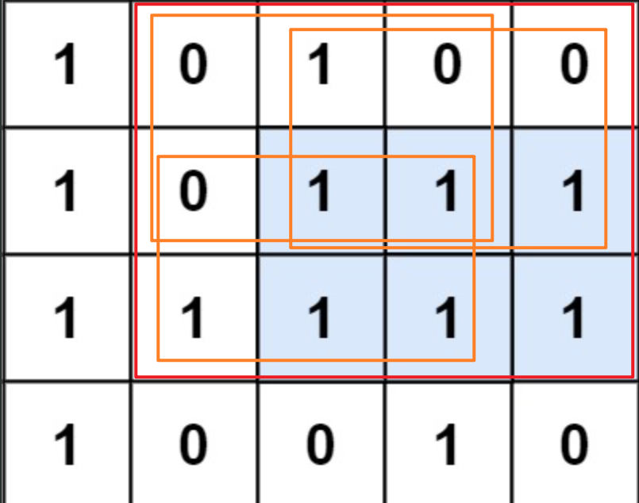

# 热门100题part16（538.把二叉搜索树转换为累加树 84.柱状图中最大的矩形 85.最大矩形 105.从前序与中序遍历序列构造二叉树 15.三数之和 10.正则表达式匹配 76.最小覆盖子串）

## 538.把二叉搜索树转换为累加树

乍一看理解不了题意，弄明白之后发现就是在二叉树上算前缀和，只不过顺序是反中根遍历。

```c++
class Solution
{
    int sum = 0;

public:
    TreeNode *convertBST(TreeNode *root)
    {
        if (root == nullptr)
        {
            return nullptr;
        }
        convertBST(root->right);
        sum += root->val;
        root->val = sum;
        convertBST(root->left);
        return root;
    }
};
```

## 84.柱状图中最大的矩形

感觉像是滑动窗口，求数组的一个区间，要求区间的最小值与区间长度的乘积最大。
枚举每个柱子作为最小值的情况，对于一个柱子，他参与的最大矩形取决于两边大于等于自己的柱子数量与自己高度的乘积，也就是找到两边第一个小于这个柱子的。
那么可以维护一个单调递增的栈，来求出每个柱子的邻接且比自己高的柱子数量。

```c++
class Solution
{
public:
    int largestRectangleArea(vector<int> &heights)
    {
        stack<int> s;
        int n = heights.size();
        vector<int> dp(n, 1);
        // 前缀
        int i = 0;
        while (i < n)
        {
            if (s.empty())
            {
                dp[i] += i;
                s.push(i);
            }
            else
            {
                int t = s.top();
                if (heights[t] < heights[i])
                {
                    dp[i] += i - t - 1;
                    s.push(i);
                }
                else
                {
                    s.pop();
                    i--;
                }
            }
            i++;
        }
        s = stack<int>();
        i = n - 1;
        while (i >= 0)
        {
            if (s.empty())
            {
                dp[i] += n - 1 - i;
                s.push(i);
            }
            else
            {
                int t = s.top();
                if (heights[t] < heights[i])
                {
                    dp[i] += t - i - 1;
                    s.push(i);
                }
                else
                {
                    s.pop();
                    i++;
                }
            }
            i--;
        }
        int m = 0;
        for (int i = 0; i < n; i++)
        {
            m = max(m, heights[i] * dp[i]);
        }
        return m;
    }
};
```

复杂度方面，遍历三次，每个元素最多入栈一次出栈一次，因此是线性复杂度。

## 85.最大矩形

`221.最大正方形`升级版，那道题使用DP解决，尝试一下这题能不能DP。



可以看到，大矩形也是可以拆成几个同构的小矩形的，只不过正方形只要记录边长，这个要记录长和宽。
但是还有个大问题，一个点对应的最大正方形可以唯一，但是长方形可以有好几种形态。
那换种思路，先纵向，如果有连续的1则合并，得到横向的长方形，然后纵向遍历，合并这些长方形。合并过程就转化成了柱形图求最大矩形的问题了。
[84. 柱状图中最大的矩形](https://leetcode.cn/problems/largest-rectangle-in-histogram?envType=problem-list-v2&envId=2cktkvj)
ps：也是个困难题

解决后就可以用之前的的方法完成了：

```c++
class Solution
{
    // int dp[204][204];
    int getMaxRect(vector<int> &line)
    {
        stack<int> s;
        int n = line.size();
        vector<int> dp(n, 1);
        // 前缀
        int i = 0;
        while (i < n)
        {
            if (s.empty())
            {
                dp[i] += i;
                s.push(i);
            }
            else
            {
                int t = s.top();
                if (line[t] < line[i])
                {
                    dp[i] += i - t - 1;
                    s.push(i);
                }
                else
                {
                    s.pop();
                    i--;
                }
            }
            i++;
        }
        s = stack<int>();
        i = n - 1;
        while (i >= 0)
        {
            if (s.empty())
            {
                dp[i] += n - 1 - i;
                s.push(i);
            }
            else
            {
                int t = s.top();
                if (line[t] < line[i])
                {
                    dp[i] += t - i - 1;
                    s.push(i);
                }
                else
                {
                    s.pop();
                    i++;
                }
            }
            i--;
        }
        int m = 0;
        for (int i = 0; i < n; i++)
        {
            m = max(m, line[i] * dp[i]);
        }
        return m;
    }

public:
    int maximalRectangle(vector<vector<char>> &matrix)
    {
        int r = matrix.size();
        int c = matrix[0].size();
        vector<vector<int>> dp(r, vector<int>(c, 0));

        for (int j = 0; j < c; j++)
        {
            dp[0][j] = matrix[0][j] - '0';
            for (int i = 1; i < r; i++)
            {
                dp[i][j] = matrix[i][j] - '0';
                if (dp[i][j])
                {
                    dp[i][j] += dp[i - 1][j];
                }
            }
        }
        int m = 0;
        for (int i = 0; i < r; i++)
        {
            m = max(m, getMaxRect(dp[i]));
        }
        return m;
    }
};
```


## 105.从前序与中序遍历序列构造二叉树

可以从前序遍历序列找到根节点，对应地通过中序遍历序列划分左右子树，递归即可。

```c++
class Solution
{
    int i = 0;
    TreeNode *buildInner(vector<int> &preorder, vector<int> &inorder, int l, int r)
    {
        // cout << l << "," << r << "\n";
        if (l > r || i >= preorder.size())
        {
            return nullptr;
        }
        auto node = new TreeNode(preorder[i]);
        i++;
        int mid;
        for (int j = l; j <= r; j++)
        {
            if (inorder[j] == node->val)
            {
                mid = j;
                break;
            }
        }
        node->left = buildInner(preorder, inorder, l, mid - 1);
        node->right = buildInner(preorder, inorder, mid + 1, r);
        return node;
    }

public:
    TreeNode *buildTree(vector<int> &preorder, vector<int> &inorder)
    {
        return buildInner(preorder, inorder, 0, preorder.size() - 1);
    }
};
```

## 15.三数之和

两数之和升级版，但是还要给出方案，由于$-10^5 <= nums[i] <= 10^5$如果把每种两数之和都记录，空间最大会达到$10^{10}$.
先排序，然后按顺序记录两数之和，如果前面的两数之和大于后面的数的相反数，那么是不可能相加得到0的，这样就能筛掉相当多了，同时排序也达到了去重的效果。

```c++
class Solution
{
    unordered_map<int, set<pair<int, int>>> m;

public:
    vector<vector<int>> threeSum(vector<int> &nums)
    {
        int n = nums.size();
        sort(nums.begin(), nums.end());
        vector<vector<int>> ans;
        set<vector<int>> toans;
        if (nums[0] > 0 && nums[n - 1] < 0)
        {
            return ans;
        }

        for (int i = 1; i < n; i++)
        {
            if (m.find(-nums[i]) != m.end())
            {
                for (auto &p : m[-nums[i]])
                {
                    // ans.push_back(vector<int>({p.first, p.second, nums[i]}));
                    toans.insert({p.first, p.second, nums[i]});
                }
            }
            for (int j = 0; j < i && i != n - 1; j++)
            {
                int s = nums[i] + nums[j];
                if (s > -nums[i + 1])
                {
                    break;
                }
                if (m.find(s) == m.end())
                {
                    m.insert(make_pair(s, set<pair<int, int>>()));
                }
                m[s].insert(make_pair(nums[j], nums[i]));
            }
        }
        ans.assign(toans.begin(), toans.end());
        return ans;
    }
};
```

时间空间只击败了5%。

另一个思路，可以转化成两数之和的问题，参考那个做法，只需要把第三个数字换成target即可。

## 10.正则表达式匹配

先从DFS试了下成功过了，只是时间有点难看，然后优化了一下，具体规则就是把模式串中连续的a*以及之类的合并了，减少DFS的深度。

```c++
class Solution
{
    bool ans = false;
    void dfs(string &s, string &p, int i, int j)
    {
        while (!ans && i <= s.size())
        {
            if (j >= p.size() && i >= s.size())
            {
                ans = true;
                return;
            }
            if (j + 1 < p.size() && p[j + 1] == '*')
            {
                j++;
                continue;
            }
            char c = p[j];
            if (c == '*')
            {
                dfs(s, p, i, j + 1);
                c = p[j - 1];
                if (c == s[i] || c == '.')
                {
                    dfs(s, p, i + 1, j);
                }
                return;
            }
            else
            {
                if (c != s[i] && c != '.')
                {
                    return;
                }
                i++;
                j++;
            }
        }
    }

public:
    bool isMatch(string s, string p)
    {
        string pt;
        char pre_c = 0;
        bool star = false;
        int i = 0;
        int j = 0;
        p += 'a';
        while (i < p.size() - 1)
        {
            if (p[i + 1] == '*')
            {
                if (!(j >= 2 && pt[j - 1] == '*' && (pt[j - 2] == p[i] || pt[j - 2] == '.')))
                {
                    pt += p[i];
                    pt += '*';
                    j += 2;
                }
                i += 2;
            }
            else
            {
                pt += p[i];
                i++;
                j++;
            }
        }
        dfs(s, pt, 0, 0);
        return ans;
    }
};
```

```
Your runtime beats 100 % of cpp submissions
Your memory usage beats 98.36 % of cpp submissions (7.9 MB)
```

时间空间都达到最优水平。

## 76.最小覆盖子串

进阶要求：设计一个$o(m+n)$时间内解决此问题的算法
与`3.无重复字符的最长子串`有些类似，也可以采用这种思路，记录已有集合中的各个字母下标，出现新的之后舍弃旧的，但是有个难点是t中可能有重复字符，那就需要引入队列来存位置；每当所有队列都满时，就测试能否删除先到的字符并且不影响队列全满，来得到最小长度。
算法中，t串扫描一次，s串每个字符进一次出一次，因此时间复杂度符合$O(m+n)$

```c++
class Solution
{
    struct letter
    {
        queue<int> q;
        int size;
        letter(int n) : size(n) {}
        letter() : size(0) {}
        bool insert(int idx) // 未满->满返回true
        {
            q.push(idx);
            return q.size() == size;
        }
    };
    struct window
    {
        unordered_map<char, letter> m;
        int cnt;
        deque<char> dq;
        window(string &t) : cnt(0)
        {
            for (const auto &i : t)
            {
                if (m.find(i) == m.end())
                {
                    m.insert(make_pair(i, letter(0)));
                }
                m[i].size++;
            }
        }
        void insert(char c, int idx)
        {
            dq.push_back(c);
            if (m.find(c) == m.end())
            {
                return;
            }
            if (m[c].insert(idx))
            {
                cnt++;
            }
        }
        int minfy()
        {
            while (1)
            {
                char now = dq.front();

                if (m.find(now) == m.end())
                {
                    dq.pop_front();
                    continue;
                }
                if (m[now].q.size() <= m[now].size)
                {
                    break;
                }
                dq.pop_front();
                m[now].q.pop();
            }
            return dq.size();
        }
    };

public:
    string minWindow(string s, string t)
    {
        int m = s.size();
        int n = t.size();
        if (m < n)
        {
            return "";
        }
        int min_len = 0x3f3f3f3f;
        int min_idx = -1;
        window win(t);
        for (int i = 0; i < m; i++)
        {
            win.insert(s[i], i);
            if (win.cnt >= win.m.size())
            {
                int len = win.minfy();
                if (len < min_len)
                {
                    min_idx = i;
                    min_len = len;
                }
            }
        }
        if (min_idx == -1)
        {
            return "";
        }
        return s.substr(min_idx - min_len + 1, min_len);
    }
};
```

写完发现不用队列，其实只需要一个计数器就够了。